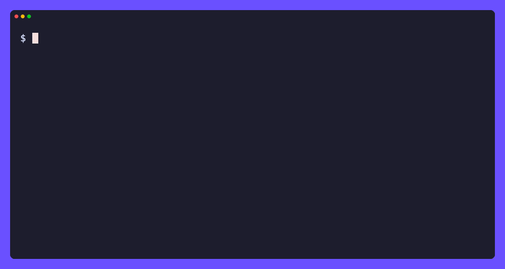

# hf

[](https://github.com/tamnd/hf-cli/actions/workflows/ci.yml)
[](https://github.com/tamnd/hf-cli/releases/latest)
[](https://pkg.go.dev/github.com/tamnd/hf-cli)
[](https://goreportcard.com/report/github.com/tamnd/hf-cli)
[](./LICENSE)

**hf** reads huggingface.co as data.
One pure-Go binary turns the hub into typed records: every model, dataset, space, kernel, user, org, collection, paper, post, blog entry, and discussion, each with a canonical `hf://` address, every field its source returned, and typed edges to everything it names.
Read one thing, list a million, walk the graph, or export the lot as RDF.

[Install](#install) • [Quick start](#quick-start) • [Read one thing](#read-one-thing) • [List many](#list-many) • [Datasets](#look-inside-a-dataset) • [Graph](#walk-the-graph) • [Linked data](#export-linked-data) • [Output](#output) • [Serve](#serve-it) • [Driver](#use-it-as-a-resource-uri-driver)



The hub is already a knowledge graph that happens to be served as a website with an API bolted to the side.
Models cite papers, datasets train models, spaces load both, orgs own all of it, and every one of those relations is written down somewhere in the payloads.
Most tools hand you back a page, or a subset of fields somebody decided you needed.
`hf` reads all of it, keeps all of it, and gives each entity an address.

No API key for public data, no daemon, no database, nothing to run alongside it.

Full docs and guides live at **[tamnd.github.io/hf-cli](https://tamnd.github.io/hf-cli/)**.

## Install

```bash
go install github.com/tamnd/hf-cli/cmd/hf@latest
```

Prefer a prebuilt binary?
Grab an archive, a `.deb`/`.rpm`/`.apk`, or a signed checksum from [releases](https://github.com/tamnd/hf-cli/releases).
Or let a package manager handle it:

```bash
# Homebrew (macOS)
brew install --cask tamnd/tap/hf

# Scoop (Windows)
scoop bucket add tamnd https://github.com/tamnd/scoop-bucket
scoop install hf

# apt (Debian, Ubuntu)
curl -fsSL https://tamnd.github.io/linux-repo/gpg.key | sudo gpg --dearmor -o /usr/share/keyrings/tamnd.gpg
echo "deb [signed-by=/usr/share/keyrings/tamnd.gpg] https://tamnd.github.io/linux-repo/apt stable main" | sudo tee /etc/apt/sources.list.d/tamnd.list
sudo apt update && sudo apt install hf

# dnf (Fedora, RHEL)
sudo dnf config-manager --add-repo https://tamnd.github.io/linux-repo/dnf/tamnd.repo
sudo dnf install hf

# container
docker run --rm ghcr.io/tamnd/hf:latest models --author google -n 5
```

## Quick start

```bash
hf model google-bert/bert-base-uncased          # a record, not a page
hf models --author google -n 10                 # a list, streamed
hf get https://huggingface.co/google/gemma-3-27b-it   # paste anything
```

`hf get` takes a bare id, a URL you copied out of a browser, or an `hf://` URI, works out what it points at, and reads it.
Every other read command is the same thing with the kind already decided.

Output adapts to where it goes: an aligned table on your terminal, JSONL the moment you pipe it somewhere.

## Read one thing

```bash
hf model google-bert/bert-base-uncased        # every field the API returns
hf model google-bert/bert-base-uncased --deep # plus the fields only the page has
hf dataset rajpurkar/squad --card             # plus the README body
hf space black-forest-labs/FLUX.1-dev         # runtime state included
hf org google                                 # the whole profile
hf paper 1810.04805                           # authors and what cites it
```

Every record keeps what it does not model.
Anything the hub sends that this version has no field for lands in `extra` as raw JSON, and the test suite fails when something shows up there, so a hub change becomes a failing test rather than data you never saw.

## List many

```bash
hf models --author google --task text-generation --sort downloads -n 100
hf datasets --search squad
hf search bert                    # every entity kind at once
hf trending --type model
hf papers --daily
hf collections --item models/google-bert/bert-base-uncased
```

Listing streams.
`-n` stops early without fetching the next page, and no command holds a full result set in memory unless a format forces it to.

## Look inside a dataset

The dataset viewer is a second API on its own host, and `hf` treats it as part of the same tool:

```bash
hf splits  rajpurkar/squad
hf schema  rajpurkar/squad --split train
hf rows    rajpurkar/squad --split train --offset 0 -n 5
hf stats   rajpurkar/squad --split train
hf dsearch rajpurkar/squad "beyonce"
hf filter  rajpurkar/squad "title = 'Beyonce'"
hf parquet rajpurkar/squad
```

`filter` runs a SQL-ish `WHERE` clause server side, so it is the cheap way to pull a subset out of a dataset far too large to download.

## Look inside a repository

```bash
hf tree google-bert/bert-base-uncased --recursive
hf cat google-bert/bert-base-uncased config.json
hf readme rajpurkar/squad
hf card rajpurkar/squad               # the parsed front matter
hf commits google-bert/bert-base-uncased -n 20
hf refs google-bert/bert-base-uncased
```

## Walk the graph

```bash
hf graph google-bert/bert-base-uncased        # the node and its edges
hf edges google-bert/bert-base-uncased        # just the edges
hf crawl google/gemma-3-27b-it --depth 2      # breadth-first from a seed
hf children google-bert/bert-base-uncased     # what was fine-tuned from it
hf parents  Jorgeutd/bert-base-uncased-finetuned-surveyclassification
hf citations 1810.04805                       # every repo tagged with a paper
```

Edges come from four places: explicit id references in the API payloads, namespace prefixes on repo ids, decoded tags, and README front matter.
Each edge records which one it came from, so a consumer can decide how much to trust it.

## Export linked data

```bash
hf rdf google-bert/bert-base-uncased --format ttl
hf rdf google-bert/bert-base-uncased --format jsonld
hf export google/gemma-3-27b-it --depth 2 --format jsonl > gemma.jsonl
hf croissant rajpurkar/squad          # the hub's own Croissant document
```

RDF comes out as N-Triples, Turtle, JSON-LD, or N-Quads, over `schema.org` where a term exists and an `hf:` namespace where none does.
N-Triples and N-Quads stream, so a crawl of a large org never needs the graph in memory.

## The page plane

Parts of the hub have no API at all, and other parts return more to a browser than to `/api`.
`hf` reads the rendered page for those, pulling the JSON the page already carries rather than scraping text:

```bash
hf page google-bert/bert-base-uncased   # 1:1 with what the browser gets
hf model google-bert/bert-base-uncased --deep
```

`--deep` is what gets you decoded tag objects with human labels, discussion counts, linked spaces with their live running state, paper AI summaries, and an org's whole profile in one request instead of seven.

## Output

Every command shares one contract: `-o table|json|jsonl|csv|tsv|url|raw`, `--fields` to pick columns, `--template` for a custom line, `-n` to limit.

```bash
hf models --author google --fields id,downloads,likes
hf models --author google --template '{{.id}} has {{.downloads}} downloads'
hf model google-bert/bert-base-uncased -o json | jq .safetensors
```

`-o url` is the one the others are measured against.
It prints one URL per record and nothing else, so this composes with no glue:

```bash
hf models --author google -n 50 -o url | xargs -n1 hf get
```

Failures are typed too.
Every surface exits 3 on an empty result, 4 when a token is needed, 5 on a rate limit, 6 on not found, 7 on unsupported, and 8 on a network failure, so a script can branch on the code without reading the message.

## Auth

Public reads need no token.
For private repos and `hf whoami`, pass `--token` or set `$HF_TOKEN`, `$HUGGING_FACE_HUB_TOKEN`, or a token file at `$HF_HOME/token`, which is where `huggingface-cli login` writes.

## Serve it

The same operations are available over HTTP and as an MCP tool set for agents, with no extra code:

```bash
hf serve --addr :7777    # GET /v1/model/<ref> returns NDJSON
hf mcp                   # speak MCP over stdio
```

## Use it as a resource-URI driver

`hf` registers a `hf` domain the way a program registers a database driver with `database/sql`.
A host enables it with one blank import:

```go
import _ "github.com/tamnd/hf-cli/hf"
```

Then [ant](https://github.com/tamnd/ant), or any program that links the package, dereferences `hf://` URIs without knowing anything about the hub:

```bash
ant get hf://model/google-bert/bert-base-uncased
ant cat hf://model/google-bert/bert-base-uncased
ant ls  hf://org/google
ant url hf://dataset/rajpurkar/squad
```

## How it works

One `kit.Handle` registration per operation, and every surface updates itself:

```
cmd/hf/   thin main: hands cli.NewApp to kit.Run
cli/      assembles the kit App and registers every operation
hf/       the library: client, records, page plane, graph, RDF, domain.go
hftest/   records real exchanges with the hub and replays them offline
docs/     tago documentation site and the demo tape
```

That single declaration becomes a CLI command, an HTTP route, an MCP tool, and a URI dereference, so there is no second implementation to keep in step.
See [add a command](https://tamnd.github.io/hf-cli/guides/adding-a-command/) for the three pieces involved.

## Development

```bash
make build      # ./bin/hf
make test       # go test ./..., offline, replays the recorded fixtures
make vet        # go vet ./...
make fixtures   # re-record against the live hub, then refresh the goldens
```

The tests run against the hub's real answers.
`hf/testdata/live` holds a recorded exchange for every command in the table, and the offline run replays them, checks that no record dropped a field into `extra`, and compares the set of populated field paths against a golden.
Values are deliberately not pinned: a download count changes hourly, and a golden full of them stops being a test.

Re-record with `make fixtures` when the hub changes something, then read the golden diff before committing it.
Recording is anonymous, so the fixtures are what any reader sees.

The demo above is a tape, not a screen recording.
Regenerate it with [ascii-gif](https://github.com/tamnd/ascii-gif):

```bash
ascii-gif render docs/demo/hf.tape -o docs/static/demo.gif
```

## Releasing

Push a version tag and GitHub Actions runs GoReleaser, which builds the archives, Linux packages, the multi-arch GHCR image, checksums, SBOMs, and a cosign signature:

```bash
git tag -a v0.2.0 -m "v0.2.0"
git push --tags
```

The Homebrew and Scoop steps self-disable until their tokens exist, so a release works with no extra secrets.
Record what changed in [CHANGELOG.md](CHANGELOG.md) and on the release notes page in `docs/` before tagging.

## License

Apache-2.0.
See [LICENSE](LICENSE).
